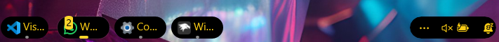
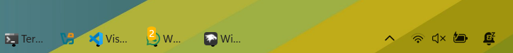

# Windhawk Windows 11 Taskbar Styler Themes

This repository contains a collection of custom taskbar styles for **Windhawk**, designed to enhance the appearance of the Windows taskbar using acrylic, color, and minimal design aesthetics. Each JSON file in this repo corresponds to a unique theme that modifies the look and feel of the taskbar.

## Included Styles

### [xdark](xdark/README.md)
A dark, minimalistic theme for sleek environments.

---

### [xtranslucid](xtranslucid/README.md)
A translucent acrylic theme with centered icons and a subtle gold border for a clean, modern look.

---

### [xtranslucid-light](xtranslucid-light/README.md)
A translucent acrylic theme with centered icons and a subtle gold border for a clean, modern look, light mode.

---

### [xblackgold](xblackgold/README.md)
A dark, minimalistic theme for sleek environments.

---
### `xdeepocean.json`
Inspired by deep ocean tones, offering a cool, calm appearance.

---

### `xgold.json`
A bold and shiny golden theme for a luxurious look.

---

### `xgrapepurple.json`
A modern purple-toned style with vibrant flair.

---

### `xicegray.json`
A clean and soft icy gray theme for clarity and neutrality.

---

## Features

- Custom corner radius and padding
- Transparent and acrylic backgrounds
- Theme-aware foreground (text and icons)
- Focus on readability and elegance
- Lightweight modifications that respect system UX

## How to Use

1. Make sure [Windhawk](https://windhawk.net/) is installed on your system.
2. Copy any of the `.json` files into Windhawk's **Notification Center Styler** or **Taskbar Styler** module.
3. Apply the style from Windhawk's configuration interface.
4. Restart Explorer (if necessary) for the changes to take full effect.

> 💡 **Tip**: Use `xtranslucid.json` if you want a modern, minimal, semi-transparent look with a clean border around centered icons only.

## License

This project is released under the MIT License. Feel free to modify, share, or integrate these styles into your own setups.

© 2025 xscriptorcode (xscriptor) — Released under the MIT License

---

Made with ❤️ for personalization fans.
