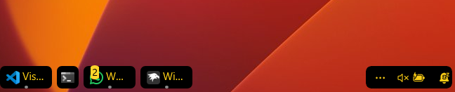

#  xblackgold theme for Windows 11 Taskbar Styler

**Author**: [xscriptorcode](https://github.com/xscriptorcode)



**Note**: This theme is intended for **dark mode setups**. Please enable Windows dark mode for proper visibility of the golden accents and black background.

---

#  Overview

`xblackgold` is a bold and elegant theme for Windows 11's taskbar using Windhawk’s **Taskbar Styler**. It combines a **fully black background** with **golden text and icon accents**, rounded corners, and a subtle yet dynamic system accent color indicator for running apps.

This theme is ideal for users who want a sleek, professional aesthetic with refined visual hierarchy and high contrast.

---

#  Required Windhawk Mods for Full Effect

To achieve the full implementation of the `xblackgold` theme, make sure to:

- Enable **dark mode** in Windows.
- Install and configure the following Windhawk mods in addition to **Taskbar Styler**:

---

### ▸ Taskbar Clock Customization

Customize the system clock to match the theme’s golden look.

<details>
<summary>Click to expand JSON content</summary>

```json
{
  "ShowSeconds": 1,
  "TimeFormat": "HH':'mm",
  "DateFormat": "dd'/'MM'/'yyyy",
  "WeekdayFormat": "",
  "TopLine": "",
  "MiddleLine": "",
  "BottomLine": "║▌║%date% X %time% ▌│",
  "TooltipLine": "%web1_full%",
  "Width": 180,
  "Height": 60,
  "TextSpacing": 0,
  "TimeStyle.Visible": 1,
  "TimeStyle.TextColor": "#facc15",
  "TimeStyle.TextAlignment": "Center",
  "TimeStyle.FontSize": 12,
  "TimeStyle.FontFamily": "JetBrainsMono NF",
  "TimeStyle.FontWeight": "ExtraLight",
  "TimeStyle.CharacterSpacing": 0,
  "DateStyle.TextColor": "#facc15",
  "DateStyle.TextAlignment": "Center",
  "DateStyle.FontSize": 12,
  "DateStyle.FontFamily": "Times New Roman",
  "DateStyle.FontWeight": "Light",
  "DateStyle.FontStretch": "SemiCondensed",
  "DateStyle.CharacterSpacing": 1,
  "oldTaskbarOnWin11": 0,
  "TimeStyle.Hidden": 1,
  "DateStyle.Hidden": 0
}
```

</details>

---

### ▸ Taskbar Height and Icon Size

<details>
<summary>Click to expand JSON content</summary>

```json
{
  "IconSize": 15,
  "TaskbarHeight": 35,
  "TaskbarButtonWidth": 30
}
```

</details>

---

### ▸ Taskbar Labels for Windows 11

Enable clean labels with margin separation and formatting.

<details>
<summary>Click to expand JSON content</summary>

```json
{
  "taskbarItemWidth": 60,
  "minimumTaskbarItemWidth": 50,
  "maximumTaskbarItemWidth": 120,
  "runningIndicatorStyle": "centerFixed",
  "progressIndicatorStyle": "sameAsRunningIndicatorStyle",
  "fontSize": 12,
  "leftAndRightPaddingSize": 8,
  "spaceBetweenIconAndLabel": 8,
  "labelForSingleItem": "%name%",
  "labelForMultipleItems": "[%amount%] %name%",
  "mode": "labelsWithCombining",
  "excludedPrograms[0]": "excluded1.exe",
  "alwaysShowThumbnailLabels": 0,
  "fontFamily": "",
  "runningIndicatorHeight": 0,
  "runningIndicatorVerticalOffset": 0
}
```

</details>

---

#  Manual Installation

To manually apply this theme:

1. Open the **Windows 11 Taskbar Styler** mod in Windhawk.
2. Go to the **Advanced** tab.
3. Paste the following JSON content into the "Mod settings" section and click **Save**.

<details>
<summary>Click to expand JSON content</summary>

```json
{
  "theme": "xblackgold",
  "controlStyles[0].target": "Taskbar.TaskListButton",
  "controlStyles[0].styles[0]": "CornerRadius=6",
  "resourceVariables[0].variableKey": "",
  "resourceVariables[0].value": "",
  "controlStyles[1].target": "SystemTray.TextIconContent > Grid#ContainerGrid > SystemTray.AdaptiveTextBlock#Base > TextBlock#InnerTextBlock",
  "controlStyles[1].styles[0]": "FontSize=16",
  "controlStyles[1].styles[1]": "Foreground=#facc15",
  "controlStyles[2].target": "SystemTray.NotifyIconView#NotifyItemIcon",
  "controlStyles[2].styles[0]": "MinWidth=25",
  "controlStyles[3].target": "SystemTray.OmniButton#ControlCenterButton > Grid > ContentPresenter > ItemsPresenter > StackPanel > ContentPresenter[1] > SystemTray.IconView > Grid > Grid",
  "controlStyles[3].styles[0]": "Visibility=Collapsed",
  "controlStyles[4].target": "SystemTray.TextIconContent > Grid#ContainerGrid",
  "controlStyles[4].styles[0]": "Padding=2",
  "controlStyles[5].target": "SystemTray.ChevronIconView",
  "controlStyles[5].styles[0]": "MinWidth=27",
  "controlStyles[6].target": "SystemTray.OmniButton#NotificationCenterButton > Grid > ContentPresenter > ItemsPresenter > StackPanel > ContentPresenter > SystemTray.IconView#SystemTrayIcon > Grid > Grid > SystemTray.TextIconContent",
  "controlStyles[6].styles[0]": "Visibility=Collapsed",
  "controlStyles[7].target": "Taskbar.TaskListLabeledButtonPanel > Border#BackgroundElement",
  "controlStyles[7].styles[0]": "Background=#000000",
  "controlStyles[7].styles[1]": "CornerRadius=6",
  "controlStyles[8].target": "Grid#SystemTrayFrameGrid",
  "controlStyles[8].styles[0]": "Background=#000000",
  "controlStyles[8].styles[1]": "CornerRadius=6",
  "controlStyles[8].styles[2]": "Margin=0,5,4,5",
  "controlStyles[8].styles[3]": "Padding=2,0,-18,0",
  "controlStyles[9].target": "Taskbar.TaskListButton > Grid > Rectangle#RunningIndicator",
  "controlStyles[9].styles[0]": "Height=3",
  "controlStyles[9].styles[1]": "RadiusX=1.5",
  "controlStyles[9].styles[2]": "RadiusY=1.5",
  "controlStyles[9].styles[3]": "Fill@ActiveNormal=SystemAccentColor",
  "controlStyles[9].styles[4]": "Fill@InactiveNormal=#444444",
  "controlStyles[9].styles[5]": "VerticalAlignment=Bottom",
  "controlStyles[9].styles[6]": "Margin=16,0,16,4",
  "controlStyles[9].styles[7]": "StrokeThickness=0",
  "controlStyles[10].target": "SystemTray.ImageIconContent > Grid#ContainerGrid > Image",
  "controlStyles[10].styles[0]": "Width=13",
  "controlStyles[11].target": "SystemTray.TextIconContent > Grid#ContainerGrid > SystemTray.AdaptiveTextBlock#Base > TextBlock#InnerTextBlock",
  "controlStyles[11].styles[0]": "FontSize=13",
  "controlStyles[11].styles[1]": "Foreground=#facc15",
  "controlStyles[12].target": "TextBlock#LabelControl",
  "controlStyles[12].styles[0]": "FontFamily=Segoe UI Medium",
  "controlStyles[12].styles[1]": "Foreground=#facc15",
  "controlStyles[12].styles[2]": "Margin=1,0,0,0",
  "controlStyles[13].target": "Taskbar.ExperienceToggleButton#LaunchListButton[AutomationProperties.AutomationId=StartButton]",
  "controlStyles[13].styles[0]": "Visibility=Visible",
  "controlStyles[14].target": "Windows.UI.Xaml.Controls.TextBlock#InnerTextBlock[Text=]",
  "controlStyles[14].styles[0]": "Text=",
  "controlStyles[14].styles[1]": "Foreground=#facc15",
  "controlStyles[15].target": "Rectangle#BackgroundFill",
  "controlStyles[15].styles[0]": "Fill=Transparent",
  "controlStyles[16].target": "Rectangle#BackgroundStroke",
  "controlStyles[16].styles[0]": "Fill=Transparent"
}


```

</details>

---

#  Notes

- Black background with golden highlights for maximum contrast.
- Text and icons use `#facc15` for a distinctive golden glow.
- System tray, labels and icons are aligned and compact.
- Indicator uses `SystemAccentColor` when active, `#444444` when inactive.
- Margin added to prevent icon-label overlap.

---

#  Highlighted Features

- Rounded corners (`CornerRadius=6`) across taskbar and system tray.
- Dynamic system accent indicator under active apps.
- Optional custom glyph for the Start button (``).
- Harmonized clock, labels, and padding for a premium look.

---

#  Suggested Windows Settings

- Enable **dark mode** in system settings.
- Center the taskbar icons.
- Set display scale to 100% for sharpest rendering.
- Use `Segoe UI`, `JetBrains Mono` or similar fonts for consistency.

