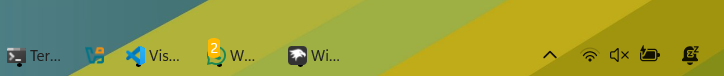

# ✦ xtranslucid-light theme for Windows 11 Taskbar Styler

**Author**: [xscriptorcode](https://github.com/xscriptorcode)



> ⚠️ **Note**: This theme is intended for **light mode**. Please enable Windows light mode to ensure proper visibility of text and indicators.

---

# ✦ Overview

`xtranslucid-light` is a clean and fully transparent theme for Windows 11’s taskbar, designed for users who prefer **light desktop environments**. Built using the Windhawk mod **Taskbar Styler**, this theme removes all backgrounds and strokes from the taskbar and tray, while keeping dark text and indicators for maximum contrast on bright setups.

---

# ✦ Manual Installation

You can manually import the styles like this:

- Open the **Windows 11 Taskbar Styler** mod in Windhawk.
- Go to the **Advanced** tab.
- Paste the following JSON content in the "Mod settings" section and click **Save**.

<details>
<summary>Click to expand JSON content</summary>

```json
{
  "theme": "xtranslucid-light",
  "controlStyles[0].target": "Rectangle#BackgroundFill",
  "controlStyles[0].styles[0]": "Fill=Transparent",
  "controlStyles[1].target": "Rectangle#BackgroundStroke",
  "controlStyles[1].styles[0]": "Fill=Transparent",
  "controlStyles[2].target": "Grid#SystemTrayFrameGrid",
  "controlStyles[2].styles[0]": "Background=Transparent",
  "controlStyles[3].target": "Taskbar.TaskListLabeledButtonPanel > Border#BackgroundElement",
  "controlStyles[3].styles[0]": "Background=Transparent",
  "controlStyles[4].target": "Taskbar.TaskListButtonPanel#ExperienceToggleButtonRootPanel > Border#BackgroundElement",
  "controlStyles[4].styles[0]": "Background=Transparent",
  "controlStyles[5].target": "Taskbar.TaskListLabeledButtonPanel@CommonStates > Rectangle#RunningIndicator",
  "controlStyles[5].styles[0]": "Fill=Black",
  "controlStyles[5].styles[1]": "Height=3",
  "controlStyles[5].styles[2]": "RadiusX=2",
  "controlStyles[5].styles[3]": "RadiusY=2",
  "controlStyles[5].styles[4]": "VerticalAlignment=Bottom",
  "controlStyles[5].styles[5]": "Margin=16,0,16,4",
  "controlStyles[5].styles[6]": "StrokeThickness=0",
  "controlStyles[6].target": "Taskbar.TaskbarBackground",
  "controlStyles[6].styles[0]": "Background=Transparent",
  "controlStyles[7].target": "Taskbar.TaskbarFrame",
  "controlStyles[7].styles[0]": "Background=Transparent",
  "controlStyles[8].target": "Taskbar.BaseBackgroundElement",
  "controlStyles[8].styles[0]": "Background=Transparent",
  "controlStyles[9].target": "Taskbar.TaskbarBackgroundElement",
  "controlStyles[9].styles[0]": "Background=Transparent",
  "controlStyles[10].target": "TextBlock#LabelControl",
  "controlStyles[10].styles[0]": "Margin=1,0,0,0",
  "controlStyles[10].styles[1]": "Foreground=#222222"
}
```
</details>

## ✦ Notes

- Fully transparent background with no borders or strokes.
- Dark text color (`#222222`) for optimal visibility on bright/light backgrounds.
- Black running indicator under active applications.
- Preserves a clean, minimal aesthetic perfect for light-themed desktops.
- Margin added to prevent label text from overlapping app icons.

## ✦ Suggested Windows Settings

- Use the default (centered) taskbar alignment.
- Enable **light mode** in Windows for correct color visibility.
- Apply wallpaper or blur effects for a floating look.
- Use additional Windhawk mods for clock and labels if desired.


## ✦ Additional Suggestions

For best results, combine this style with:

- **Taskbar Labels** – show app names beside icons.
- **Taskbar Clock Customization** – adjust clock fonts and alignment.
- **Taskbar Height and Icon Size** – refine proportions to match your taste.

## ✦ Customize Further

You can easily expand this theme by:

- Adding corner radius for rounded edges.
- Adjusting font size, family, or alignment.
- Switching indicator colors or re-enabling hidden elements.
