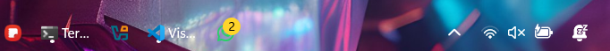

#  xtranslucid theme for Windows 11 Taskbar Styler

**Author**: [xscriptorcode](https://github.com/xscriptorcode)



> ⚠️ **Note**: This theme is intended for **dark mode**. Please enable Windows dark mode to ensure proper visibility of text and indicators.

#  Overview

`xtranslucid` is a clean and fully transparent theme for Windows 11’s taskbar, created using the Windhawk mod **Taskbar Styler**. It removes all visible backgrounds and strokes from the taskbar, system tray, and task buttons, allowing your wallpaper and blur effects to shine through.

This theme is designed for users who want a minimal, floating aesthetic where the focus is on the icons and content, not the container.

---

#  Manual Installation

You can manually import the styles like this:

* Open the **Windows 11 Taskbar Styler** mod in Windhawk.
* Go to the **Advanced** tab.
* Paste the following JSON content in the "Mod settings" section and click **Save**.

<details>
<summary>Click to expand JSON content</summary>

```json
{
  "theme": "xtranslucid",
  "controlStyles[0].target": "Rectangle#BackgroundFill",
  "controlStyles[0].styles[0]": "Fill=Transparent",
  "controlStyles[1].target": "Rectangle#BackgroundStroke",
  "controlStyles[1].styles[0]": "Fill=Transparent",
  "controlStyles[2].target": "Grid#SystemTrayFrameGrid",
  "controlStyles[2].styles[0]": "Background=Transparent",
  "controlStyles[3].target": "Taskbar.TaskListLabeledButtonPanel > Border#BackgroundElement",
  "controlStyles[3].styles[0]": "Background=Transparent",
  "controlStyles[4].target": "Taskbar.TaskListButtonPanel#ExperienceToggleButtonRootPanel > Border#BackgroundElement",
  "controlStyles[4].styles[0]": "Background=Transparent",
  "controlStyles[5].target": "Taskbar.TaskListLabeledButtonPanel@CommonStates > Rectangle#RunningIndicator",
  "controlStyles[5].styles[0]": "Fill=White", 
  "controlStyles[5].styles[1]": "Height=3",
  "controlStyles[5].styles[2]": "RadiusX=2",
  "controlStyles[5].styles[3]": "RadiusY=2",
  "controlStyles[5].styles[4]": "VerticalAlignment=Bottom",
  "controlStyles[5].styles[5]": "Margin=16,0,16,4",
  "controlStyles[5].styles[6]": "StrokeThickness=0",
  "controlStyles[6].target": "Taskbar.TaskbarBackground",
  "controlStyles[6].styles[0]": "Background=Transparent",
  "controlStyles[7].target": "Taskbar.TaskbarFrame",
  "controlStyles[7].styles[0]": "Background=Transparent",
  "controlStyles[8].target": "Taskbar.BaseBackgroundElement",
  "controlStyles[8].styles[0]": "Background=Transparent",
  "controlStyles[9].target": "Taskbar.TaskbarBackgroundElement",
  "controlStyles[9].styles[0]": "Background=Transparent",
  "controlStyles[10].target": "TextBlock#LabelControl",
  "controlStyles[10].styles[0]": "Margin=1,0,0,0" 
}

```
</details>

##  Notes

- `xtranslucid` removes all solid fills, strokes and backgrounds, making the taskbar fully transparent.
- Ideal for setups using dynamic wallpapers, glassmorphism, or blurred effects.
- Compatible with other Windhawk mods like **Taskbar Labels**, **Clock Customization**, or **Height & Icon Size**.
- Designed for modern minimalist desktops where less is more.

##  Suggested Windows Settings

- Use the default (centered) taskbar alignment.
- Enable dark mode in Windows for consistency.
- Set taskbar background effects via system personalization (e.g., transparency effects).
- Use app labels if desired via the **Taskbar Labels for Windows 11** Windhawk mod.

##  Preview

Here's how the `xtranslucid` theme looks with app icons centered and the background fully transparent:


##  Additional Suggestions

For a better look and compatibility, consider combining this style with:

- **Taskbar Labels** – to display app names next to icons.
- **Taskbar Clock Customization** – to style the clock to match your setup.
- **Taskbar Height and Icon Size** – to adjust proportions for a more compact or expanded appearance.

##  Customize Further

You can easily expand this theme by adding:

- Corner radii to buttons for rounded aesthetics.
- Color overlays or borders if needed.
- Re-enable the running indicators with different colors.
